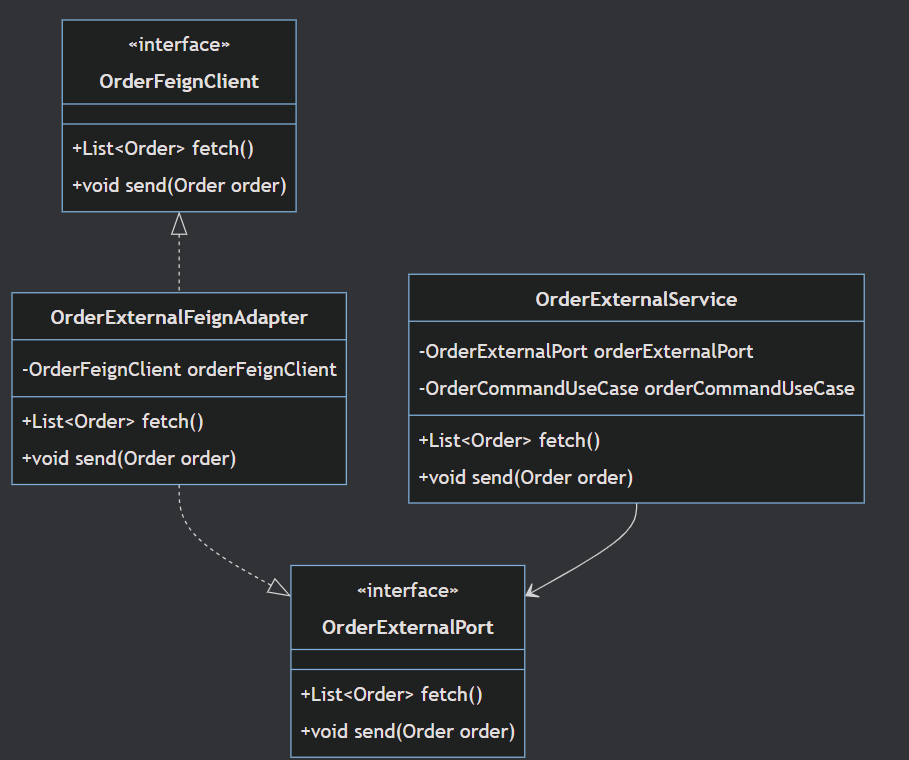

# 주문 데이터 연동 시스템

## 프로젝트 개요

- `목적`: 주문 데이터를 외부 시스템과 연동하고, 메모리에 저장/조회/전송 기능을 제공하는 주문 관리 시스템
- `주요 기능`
  - 외부 시스템에서 주문 데이터 수집 및 전송(`OpenFeign`)
  - 주문 데이터 메모리 저장 및 조회

<br>

---

## 기술 스택

- Java 21
- Spring Boot 3.4.5
- OpenFeign (외부 시스템 연동)
- Resilience4j (재시도, fallback 처리)
- JUnit 5 (테스트)
- OkHttp MockWebServer (E2E 테스트)
- Gradle
- Hexagonal Architecture 적용

<br> 

---

## ▶️ 실행 방법

### 로컬 실행

```bash
./gradlew bootRun
```

### 테스트 실행

```bash
./gradlew test
```

<br>

---

## 외부 연동 관련 클래스 설명



<br>

| 클래스                         | 역할 및 책임                                                                                                                   |
|-----------------------------|---------------------------------------------------------------------------------------------------------------------------|
| `OrderFeignClient`          | 외부 시스템과 HTTP 통신을 담당하는 OpenFeign 인터페이스입니다. 주문 데이터 조회(fetch), 전송(send) 기능 제공하며, 요청/응답 포맷을 JSON으로 정의합니다.                     |
| `OrderExternalFeignAdapter` | `OrderExternalPort`를 구현하는 실제 외부 연동 Adapter입니다. 내부 서비스에서 호출 시 `OrderFeignClient`를 통해 외부 API와 통신하고, 추후 원하는 응답 형태로 포맷 가능합니다. |
| `OrderExternalService`      | 비즈니스 서비스 계층으로, 외부 주문 조회 및 전송을 담당합니다. 비즈니스 정책에 따라 예외 처리, 재시도, fallback 처리 로직 포함하며 InMemory 저장소 연계 기능도 포함됩니다.               |
| `OrderExternalPort`         | 외부 연동 추상화 인터페이스입니다. 비즈니스 로직과 외부 API 호출 간 의존성을 분리하고, 향후 다른 시스템 연동 시 확장 포인트로 활용됩니다.                                         |

---
